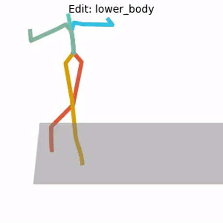

# SinMDM: Single Motion Diffusion


Please visit our [project page](https://sinmdm.github.io/SinMDM-page/) for more details.

## Setup

This code has been tested in the following environment:
* Ubuntu 18.04.5 LTS
* Python 3.8
* conda3 or miniconda3
* CUDA capable GPU (one is enough) 

Setup conda env:
```shell
conda env create -f environment.yml
conda activate SinMDM
```

Install ganimator-eval-kernel by following [these](https://github.com/PeizhuoLi/ganimator-eval-kernel) instructions,  OR by running: 
```shell 
pip install git+https://github.com/PeizhuoLi/ganimator-eval-kernel.git
```

## Preparations

### Get Data

Data should be under the `./dataset` folder.

<details>
  <summary><b>Mixamo Dataset</b></summary>

Download the motions used for our benchmark:
```shell
bash prepare/download_mixamo_dataset.sh
```

Or download motions directly from [Mixamo](https://www.mixamo.com/#/) and use `utils/fbx2bvh.py` to convert fbx files to bvh files.

</details>

<details>
  <summary><b>HumanML3D Dataset</b></summary>

Clone HumanML3D, then copy the data dir to our repository:

```shell
cd ..
git clone https://github.com/EricGuo5513/HumanML3D.git
unzip ./HumanML3D/HumanML3D/texts.zip -d ./HumanML3D/HumanML3D/
cp -r HumanML3D/HumanML3D sin-mdm/dataset/HumanML3D
cd sin-mdm
```

Then, download the motions used for our benchmark: 
```shell
bash prepare/download_humanml3d_dataset.sh
```
Or download the entire dataset by following the instructions in [HumanML3D](https://github.com/EricGuo5513/HumanML3D.git),
then copy the result dataset to our repository:

```shell
cp -r ../HumanML3D/HumanML3D ./dataset/HumanML3D
```
</details>

<details>
  <summary><b>Truebones zoo Dataset</b></summary>

Download motions used in our pretrained models:
```shell
bash prepare/download_truebones_zoo_dataset.sh
```

Or download the full dataset [here](https://truebones.gumroad.com/l/skZMC) and use `utils/fbx2bvh.py` to convert fbx files to bvh files.
</details>


## Synthesis
### Preparations
#### Download pretrained models

Download the model(s) you wish to use using the scripts below. The models will be placed under `./save/`.

<details>
  <summary><b>Mixamo Dataset Models</b></summary>

Download pretrained models used for our benchmark:
```shell
bash prepare/download_mixamo_models.sh
```
</details>

<details>
  <summary><b>HumanML3D Dataset Models</b></summary>

Download pretrained models used for our benchmark:
```shell
bash prepare/download_humanml3d_models.sh
```

</details>

<details>
  <summary><b>Truebones Zoo Dataset Models</b></summary>

Download pretrained models:
```shell
bash prepare/download_truebones_models.sh
```

Pretrained model of "Flying Dragon" will be available soon!

</details>

### Run synthesis command

To generate motions using a pretrained model use the following command: 
```shell
python -m sample.generate --model_path ./save/path_to_pretrained_model --num_samples 5 --motion_length 10
```

Where `--num_samples` is the number of motions that will be generated and `--motion_length` is the length in seconds. Use `--seed` to specify a seed.

**Running this will get you:**

* `results.npy` file with xyz positions of the generated animation
* `rows_00_to_##.mp4` - stick figure animations of all generated motions.
* `sample##.bvh` - bvh file for each generated animation that can be visuallized using [Blender](https://www.blender.org/download/).

It will look something like this:


### Adding texture in Blender
<details>
<summary>Instructions for adding texture in Blender</summary>

To add texture in Blender For Mixamo and Truebones zoo datasets follow these steps:

1. In Blender, Import an FBX file that contains the mesh and texture to blender. 
   1. For Mixamo motions use: [mixamo_ref.fbx](https://drive.google.com/file/d/1s-cppg2pd3tVKWIxozP6jtxk05LFEhTI/view?usp=share_link)
   2. For motions generated by the truebones zoo uploaded models use the relevant fbx file from [here](https://drive.google.com/drive/folders/1AOp6jA5RmStpuCMxjSaODHKvFK6Oysa6?usp=share_link).
2. Select only the skeleton of the imported FBX and delete it. The mesh will then appear in T-pose.
3. Import the BVH file that was generated by the model
4. Select the mesh, go to modifier properties, and press the tooltip icon. Then, select the generated BVH.

</details>

## Training

### Preperations

Download HumanML3D dependencies:

```shell
bash prepare/download_t2m_evaluators.sh
```


### Run training command

```shell
python -m train.train_sinmdm --arch unet --dataset mixamo --save_dir <'path_to_save_models'> --sin_path <'path to .bvh file for mixamo/bvh_general dataset or .npy file for humanml dataset'> --lr_method ExponentialLR --lr_gamma 0.99998 --use_scale_shift_norm --use_checkpoint
```

* Specify architecture using `--arch` Options: unet, qna  
* Specify dataset using `--dataset` Options: humanml, mixamo, bvh_general
* Use `--device` to define GPU id.
* Use `--seed` to specify seed.
* Add `--train_platform_type {ClearmlPlatform, TensorboardPlatform}` to track results with either [ClearML](https://clear.ml/) or [Tensorboard](https://www.tensorflow.org/tensorboard).
* Add `--eval_during_training` to run a short evaluation for each saved checkpoint.
* Add `--gen_during_training` to synthesize a motion and save its visualization for each saved checkpoint.

  Evaluation and generation during training will slow it down but will give you better monitoring.

Please refer to file utils/parser_util.py for more arguments.

## Applications
### In-betweening
For in-betweening, the prefix and suffix of a motion are given as input and the model generates the rest according to the motion the network was trained on.
```shell
python -m sample.edit --model_path <path_to_pretrained_model> --edit_mode in_betweening --num_samples 3
```
* To specify the motion to be used for the prefix and suffix use `--ref_motion <path_to_reference_motion>`. If `--ref_motion` is not specified, the original motion the network was trained on will be used.
* Use `--prefix_end` and `--suffix_start` to specify the length of the prefix and suffix
* Use `--seed` to specify seed.
* Use `--num_samples` to specify number of motions to generate.

For example:

 

generated parts are colored in an orange scheme, given input is colored in a blue scheme.


### Motion expansion
For motion expansion, a motion is given as input and new prefix and suffix are generated for it by the model.

```shell
python -m sample.edit --model_path <path_to_pretrained_model> --edit_mode expansion --num_samples 3
```
* To specify the input motion use `--ref_motion <path_to_reference_motion>`. If `--ref_motion` is not specified, the original motion the network was trained on will be used.
* Use `--prefix_length` and `--suffix_length` to specify the length of the generated prefix and suffix
* Use `--seed` to specify seed.
* Use `--num_samples` to specify number of motions to generate.

For example:

 

generated parts are colored in an orange scheme, given input is colored in a blue scheme.


### Lower body editing
The model is given a reference motion from which to take the upper body, and generates the lower body according to the motion the model was trained on.

```shell
python -m sample.edit --model_path <path_to_pretrained_model> --edit_mode lower_body --num_samples 3 --ref_motion <path_to_reference_motion>
```
This application is supported for the `mixamo` and `humanml` datasets.
* To specify the reference motion to take upper body from use `--ref_motion <path_to_reference_motion>`. If `--ref_motion` is not specified, the original motion the network was trained on will be used.
* Use `--seed` to specify seed.
* Use `--num_samples` to specify number of motions to generate.

For example: (reference motion is "chicken dance" and lower body is generated with model train on "salsa dancing")

 

generated lower body is colored in an orange scheme. Upper body which is given as input is colored in a blue scheme.

### Upper body editing
Similarly to lower body editing, use `--edit_mode upper_body`

```shell
python -m sample.edit --model_path <path_to_pretrained_model> --edit_mode upper_body --num_samples 3 --ref_motion <path_to_reference_motion>
```
This application is supported for the `mixamo` and `humanml` datasets.

For example: (reference motion is "salsa dancing" and upper body is generated with model trained on "punching")

 

generated upper body is colored in an orange scheme. Lower body which is given as input is colored in a blue scheme.


### Harmonization
You can use harmonization for style transfer. The model is trained on the style motion. The content motion `--ref_motion`, unseen by the network, is given as input and adjusted such that it matches the style motion's motifs.

```shell
python -m sample.edit --model_path <path_to_pretrained_model> --edit_mode harmonization --num_samples 3 --ref_motion <path_to_reference_motion>
```

* To specify the reference motion use `--ref_motion <path_to_reference_motion>`
* Use `--seed` to specify seed.
* Use `--num_samples` to specify number of motions to generate.

For example, here the model was trained on "happy" walk, and we transfer the "happy" style to the input motion:

 


## Evaluation


### Preparations

**HumanML3D**

```shell
bash prepare/download_t2m_evaluators.sh
bash prepare/download_humanml3d_dataset.sh
bash prepare/download_humanml3d_models.sh
```

**Mixamo**

```shell
bash prepare/download_mixamo_dataset.sh
bash prepare/download_mixamo_models.sh
```

### Run evaluation command
To evaluate a single model (trained on a single sequence), run:

**HumanML3D**

```shell
python -m eval.eval_humanml --model_path ./save/humanml/0000/model000019999.pt
```

**Mixamo**

```shell
python -m eval.eval_mixamo --model_path ./save/mixamo/0000/model000019999.pt
```

### Run evaluation benchmark

**HumanML3D - reproduce benchmark**

with the pre-trained checkpoints:

```shell
bash ./eval/eval_only_humanml_benchmark.sh
```

**HumanML3D - train + benchmark**

```shell
bash ./eval/train_eval_humanml_benchmark.sh
```


**Mixamo - reproduce benchmark**

with the pre-trained checkpoints:

```shell
bash ./eval/eval_only_mixamo_benchmark.sh
```

**Mixamo - train + benchmark**

```shell
bash ./eval/train_eval_mixamo_benchmark.sh
```

## Acknowledgments

Our code partially uses each of the following works. We thank the authors of these works for their outstanding contributions and for sharing their code.

[MDM](https://github.com/GuyTevet/motion-diffusion-model), [QnA](https://github.com/moabarar/qna), [Ganimator](https://github.com/PeizhuoLi/ganimator), [Guided Diffusion](https://github.com/openai/guided-diffusion), [A Deep Learning Framework For Character Motion Synthesis and Editing](http://theorangeduck.com/page/deep-learning-framework-character-motion-synthesis-and-editing).

## License
This code is distributed under the [MIT LICENSE](LICENSE).

<!--
## Citation
If you use this code for your research, please cite our paper:

~~~bibtex
@article{raab2023single,
title={Single Motion Diffusion},
author={Raab, Sigal and Leibovitch, Inbal and Tevet, Guy and Arar, Moab and Bermano, Amit H and Cohen-Or, Daniel},
journal={arXiv preprint arXiv:2302.05905},
year={2023}
}
-->
